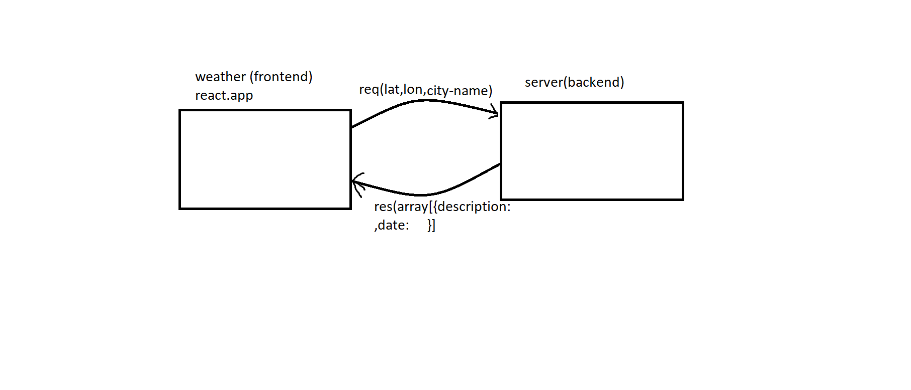

# city-explorer-api
## WRRC

**Author**: Amani AL-Zoubi
**Version**: 1.0.0

## Overview
Build own server 

## Getting Started
you need url to connect with server and send your request to get the response 

## Architecture
this app has been created using React.js

## Change Log

## Credit and Collaborations

## Time Estimates
1. Name of feature: 
    Set up your server repository.
    Estimate of time needed to complete: 20 min

    Start time: 2:30 pm

    Finish time: 2:00 pm

    Actual time needed to complete: 30 min

2. Name of feature: Weather (placeholder)
    Estimate of time needed to complete: 1 hr

    Start time: 2:00 pm

    Finish time: 3:00 pm

    Actual time needed to complete: 1 hr and half 
3. Name of feature: Map
    Estimate of time needed to complete: 30 min 

    Start time: 5:00 pm

    Finish time: 5:30 pm

    Actual time needed to complete: 30 min 

4. Name of feature: Errors
    Estimate of time needed to complete: 30 min

    Start time: 5:30 pm

    Finish time: 6:00 pm

    Actual time needed to complete: 30 min